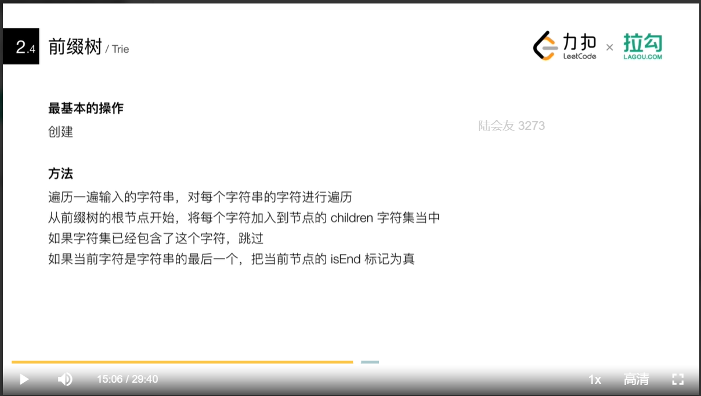
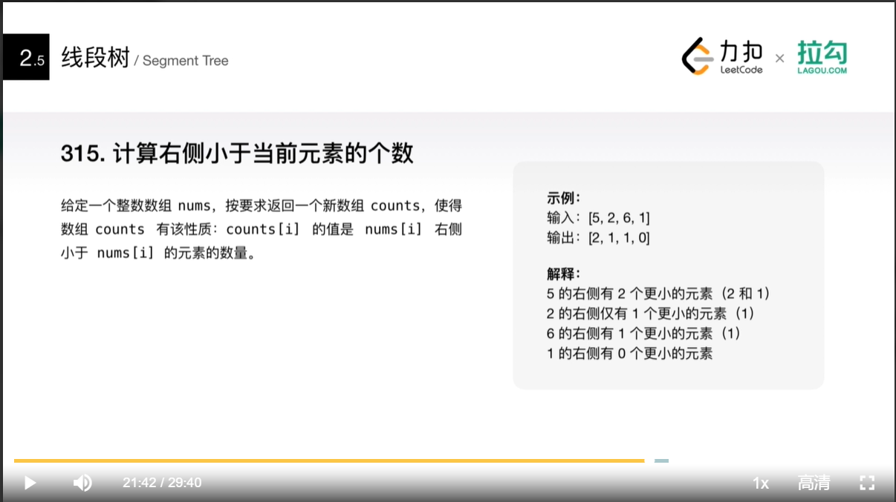

### 常用数据结构
#### 数组，字符串
+ 有效的字母异位词
#### 链表
+ 优点
    + 灵活分配内存空间
    + 在o(1)时间内删除和添加元素
+ 技巧
    + 利用快慢指针
    + 构建虚假链表头
        + 一般用于返回链表的场景
+ 题目
    + K个一组翻转链表

#### 栈
+ 题目
    + 每日温度

#### 队列

#### 双端队列
+ 使用场景
    + 实现一个长度动态变化的窗口或者连续区间
+ 题目
    + 滑动窗口最大值

#### 树
+ 题目
    + 二叉搜索中第k小的元素
        + 特性，二叉树中序遍历结果是从小到大的顺序
    
### 高级数据结构
#### 优先队列
+ 特点
    + 每次取出的元素都是优先级别最高的
    + 优先级别可以自定义
+ 本质
    + 二叉堆结构
    + 利用一个数组实现二叉树
+ 题目
    + 前K个高频元素

#### 图
+ 算法
    + 深度，广度
    + 有向，无向
    + 拓扑排序
    + 最短路径算法
    + 连通性相关算法
    + 图的着色
    + tsp问题
+ 必须掌握
    + 图存储和表达方式
        + 邻接矩阵，邻接链表
        + 图的遍历： 深度，广度
        + 二部图的检测，树的检测，环的检测： 有向图，无向图
        + 拓扑排序
        + 联合查找算法
        + 最短路径： Dijkstra,Bellman-Ford
+ 判断二部图
    + 可以将图的节点分为A,B两个子集，不同子集节点不相连，每一条边的两个节点分别来自A,B子集
#### 前缀树

#### 线段树

#### 树状数组

